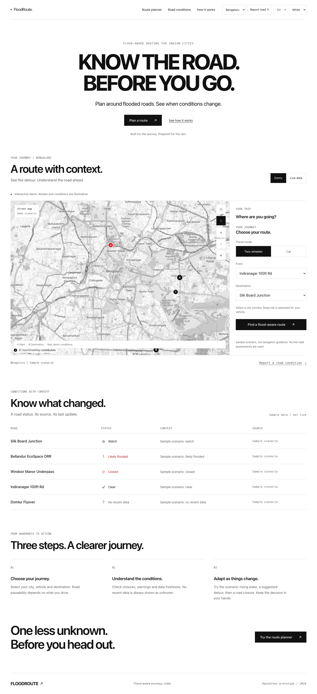

# FloodRoute

Flood-aware route planning for Indian cities. A responsive hackathon prototype with a monochrome frontend, vehicle selection, road conditions, community reports, and a controlled rerouting demonstration.



## Run the demo

Use Node.js 24 and the pinned pnpm 10.28.0:

```sh
corepack pnpm install --frozen-lockfile
corepack pnpm --filter @floodroute/citizen dev
```

Open `http://localhost:5173`. Demo mode works without a backend. Select a city and vehicle, plan a journey, and preview rising water, a detour, and a road closure. The supported city presets are Bengaluru, Mumbai, and Gurugram. White and black themes work on desktop and mobile.

Demo routes, travel times, and conditions are illustrative. Real observations and routing require a configured API and data sources. Simulation events and demo reports remain explicitly labelled.

## Build and check

```sh
corepack pnpm --filter @floodroute/ui check
corepack pnpm --filter @floodroute/citizen check
corepack pnpm --filter @floodroute/citizen preview
```

The frontend check runs TypeScript, 17 Node tests, and the production build. Publish `apps/citizen/dist` on a static host; the default presentation demo requires no API configuration. Generated bundles are built locally and in CI, rather than committed.

For the API integration:

```sh
cd apps/api
.venv/bin/pytest -q
.venv/bin/ruff check floodroute tests
```

The API suite needs its configured test database. Build the frontend first for the `/app/` serving tests. The API and frontend CI workflows perform that build from source.

## Submission material

- [Hackathon runbook, deployment configuration, and judge walkthrough](docs/HACKATHON.md)
- [Desktop](output/frontend-preview/2026-10-06/desktop.png), [mobile](output/frontend-preview/2026-10-06/mobile.png), [planned route](output/frontend-preview/2026-10-06/route.png), and [black theme](output/frontend-preview/2026-10-06/black-planner.png) screenshots
- [Original visual references and generation prompts](output/design-samples/2026-10-06-white-minimal/prompts.md)
- [Product and engineering documentation](docs/README.md)

Frontend: React, TypeScript, Vite, and MapLibre. Backend: FastAPI and PostGIS, with routing integration and scoring modules. Live route coverage, Valhalla setup, source access, and field calibration remain tracked in the [G0 evidence pack](docs/G0-evidence.md).
