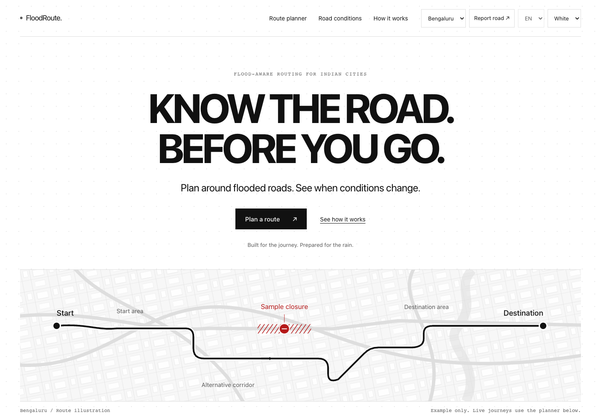
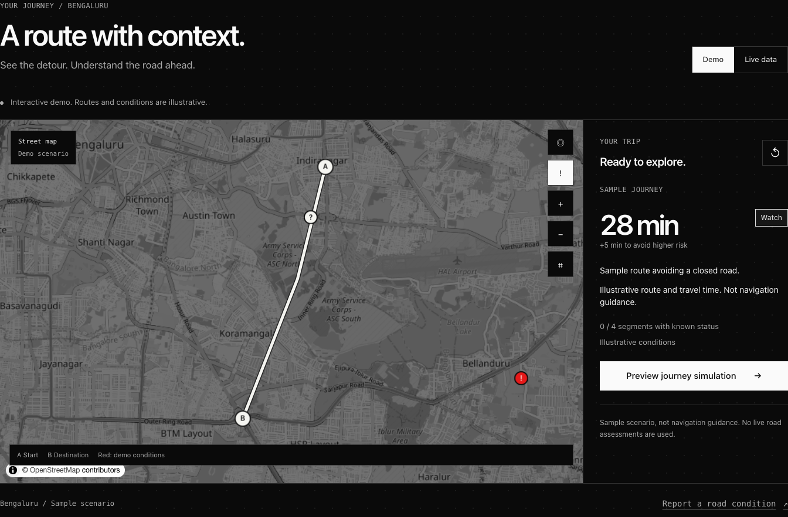
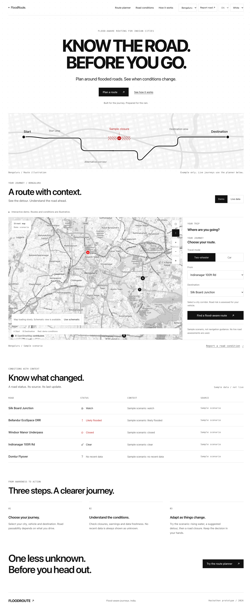
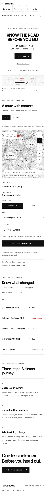
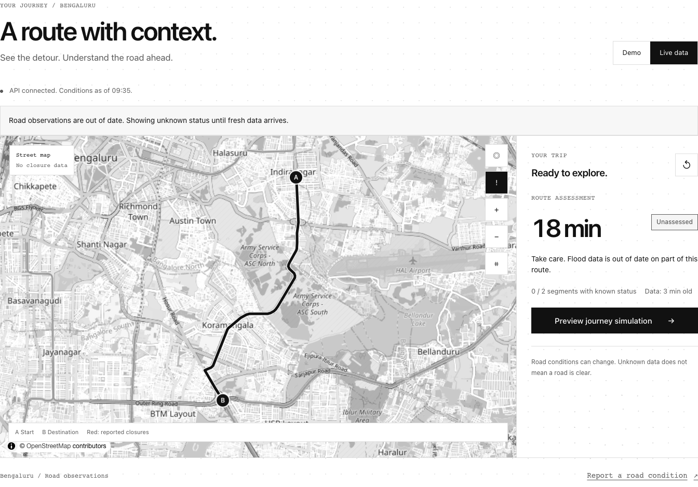

# FloodRoute

**Know the road. Before you go.**

Flood-aware route planning for Indian cities. A responsive hackathon prototype with a monochrome frontend, vehicle selection, road conditions, community reports, and a controlled rerouting demonstration.

The presentation demo runs without an API. Choose a city and vehicle, explore a sample journey, and see how the interface responds to changing road conditions. White and black themes, a responsive layout, and subtle hover dots carry the same design across desktop and mobile. Dots stay static on touch devices and with reduced motion, and stop animating when idle.

**Frontend:** React · TypeScript · Vite · MapLibre

**Backend:** FastAPI · PostGIS · Valhalla integration

## Built with spoken prompts

The prompts used to design and build FloodRoute were **dictated with Wispr Flow instead of typed by hand**. Spoken instructions were transcribed into the written prompts that guided the project.

[Wispr Flow](https://wisprflow.ai/) is an AI dictation app that turns natural speech into polished text inside the app you are using. It cleans up the transcription and inserts the result into the active text field. [Learn more](https://docs.wisprflow.ai/articles/2772472373-what-is-flow).

## Project screenshots

### White theme · Landing page



Actual browser capture. The hero route is a labelled illustration; the presentation demo does not claim live flood observations.

### Black theme · Route planner



Demo route planning with vehicle-specific controls and explicitly labelled sample conditions.

<details>
<summary><strong>More screenshots: desktop, mobile, and connected routing</strong></summary>

<table>
  <tr><th>Full desktop page</th><th>Mobile layout</th></tr>
  <tr>
    <td valign="top"></td>
    <td valign="top"></td>
  </tr>
</table>

**Connected road route**



Actual browser capture from the Docker API and our self-hosted Bengaluru Valhalla graph on 7 October. It predates the graph-edge routing update below. The route returned an 18-minute baseline estimate; its matched road status was **unknown** because rainfall observations were missing. The stale-data banner and zero known-status count reflect that limitation.

[Full sample journey screenshot](output/frontend-preview/2026-10-06-dots/route.png) · [Browser verification record](output/frontend-preview/2026-10-06-dots/verification.md)

</details>

[Progress checkpoints](PROGRESS_CHECKPOINTS.md) distinguish completed work, verified behavior, and remaining requirements.

## Run the demo

Use Node.js 24 and the pinned pnpm 10.28.0:

```sh
corepack pnpm install --frozen-lockfile
corepack pnpm --filter @floodroute/citizen dev
```

Open `http://localhost:5173`. Demo mode works without a backend. Select a city and vehicle, plan a journey, and preview rising water, a detour, and a road closure. The supported city presets are Bengaluru, Mumbai, and Gurugram. White and black themes work on desktop and mobile.

Demo routes, travel times, and conditions are illustrative. Real observations and routing require a configured API and data sources. Simulation events and demo reports remain explicitly labelled.

## Build and check

```sh
corepack pnpm --filter @floodroute/ui check
corepack pnpm --filter @floodroute/citizen check
corepack pnpm --filter @floodroute/citizen preview
```

The current frontend check passed TypeScript, 18 Node tests, and the production build. Preview opens on `http://localhost:4173`; add `--port 5174` to use that port instead. Publish `apps/citizen/dist` on a static host; the default presentation demo requires no API configuration. Generated bundles are built locally and in CI, rather than committed.

## Deploy the frontend on Vercel

Import this repository with **Root Directory `.`** and **Node.js `24.x`**. Add the environment variable `ENABLE_EXPERIMENTAL_COREPACK=1`; Vercel uses it to honor the pinned pnpm version. Install, build, and output settings are provided by [vercel.json](vercel.json). See [Vercel's Corepack guidance](https://vercel.com/docs/builds/configure-a-build#corepack).

The frontend starts in Demo mode without an API environment variable. A separate live API can be connected later with `VITE_API_BASE_URL`; Vercel's static frontend deployment does not start the Python backend.

## Connect the backend

The backend now builds and runs as a local Docker stack: API, PostGIS, worker, and self-hosted Bengaluru routing. Its source and migration changes have passed review and testing. Public deployment remains a separate step.

Follow the [backend runbook](docs/BACKEND_RUNBOOK.md) for API dependencies, PostGIS setup, migrations, routing configuration, and container commands. The current source API serves the built app at `http://127.0.0.1:8080/app/?live=1`. In Vite, select **Live data** or open `http://localhost:5173/?live=1`. Both development and preview servers proxy `/v1` to `http://127.0.0.1:8080`; override the local API target when needed:

```sh
FLOODROUTE_DEV_API_URL=http://127.0.0.1:8000 corepack pnpm --filter @floodroute/citizen dev
```

`FLOODROUTE_DEV_API_URL` configures the local Vite servers. For a deployed frontend on a separate origin, set `VITE_API_BASE_URL` **before building** and configure API CORS; the local proxy is not part of the static bundle.

Verified locally on **8 October 2026**: the refreshed Docker image built, all ten migrations applied, and the existing 5,383 OSM-derived Bengaluru road segments remained loaded. The app, health, and snapshot endpoints returned HTTP 200, and the route-required API smoke check passed against the self-hosted Bengaluru graph. A genuine 102-edge recording and an opt-in live integration test now check individual road edges, including a synthetic blocked interior edge that triggers a detour. A closure at the origin returns `no_safe_route`. The test creates its synthetic risk only in a disposable database.

MET Norway ingestion supplied 62 forecast rows for one Bengaluru zone. The 7 October bounded SACHET catch-up stored 100 official alerts; 80 lacked area geometry, chiefly because polygon requests returned HTTP 403. On 8 October the worker stored ten newly published alerts and flagged 89 more feed items for later runs. `rain_obs` was still empty, so these source checks do not establish current road passability. The [8 October verification record](output/backend-verification/2026-10-08-graph-edges/verification.md) and [earlier browser capture](output/backend-verification/2026-10-07/verification.md) state their different scopes.

Operator controls now require backend-held credentials, with a distinct co-signer for arterial reopening/cancellation and kill-switch release. Request sizes are bounded, photos are sanitized, and webhook targets are limited to public HTTPS destinations. Follow the runbook for configuration; credentials must never enter a `VITE_` variable. Subscriber alert objects are generated by the worker; SMS, WhatsApp, and push delivery still require a provider integration.

Live routing needs a configured routing service and road coverage. API availability alone does not establish fresh flood observations. Failed live requests show errors rather than demo routes; navigation previews remain explicitly simulated.

For the API integration:

```sh
cd apps/api
FLOODROUTE_REQUIRE_DB=1 .venv/bin/pytest -q
.venv/bin/ruff check floodroute tests
```

The full API suite passed **879 tests** with one expected skip for the opt-in external graph test before a small HTTP-client cleanup. After that cleanup, 71 focused route/API tests and the opt-in live graph test passed; Python lint passed. A later full rerun was interrupted when Docker Desktop shut down, so it is not counted as a pass. The suite needs PostGIS at `DATABASE_URL_ADMIN` (default `postgresql://postgres@127.0.0.1:54329/postgres`). Requiring the database makes an unavailable test database fail instead of skipping integration checks. Build the frontend first for the `/app/` serving tests. The API and frontend CI workflows perform that build from source.

## Submission material

- [Hackathon runbook, deployment configuration, and judge walkthrough](docs/HACKATHON.md)
- [Backend setup and known limitations](docs/BACKEND_RUNBOOK.md)
- [Work progress and verified checkpoints](PROGRESS_CHECKPOINTS.md)
- Current browser screenshots: [desktop](output/frontend-preview/2026-10-06-dots/desktop.png), [mobile](output/frontend-preview/2026-10-06-dots/mobile.png), [planned route](output/frontend-preview/2026-10-06-dots/route.png), and [black theme](output/frontend-preview/2026-10-06-dots/black-planner.png)
- [Self-hosted road route with unknown flood status](output/backend-verification/2026-10-07/self-hosted-route.png) and [backend verification record](output/backend-verification/2026-10-07/verification.md)
- [Original visual references and generation prompts](output/design-samples/2026-10-06-white-minimal/prompts.md)
- [Product and engineering documentation](docs/README.md)

Frontend: React, TypeScript, Vite, and MapLibre. Backend: FastAPI, PostGIS, Valhalla, and a scoring worker. Public hosting, observations, city coverage, provider messaging, and field calibration remain tracked in the [backend runbook](docs/BACKEND_RUNBOOK.md) and [G0 evidence pack](docs/G0-evidence.md).
