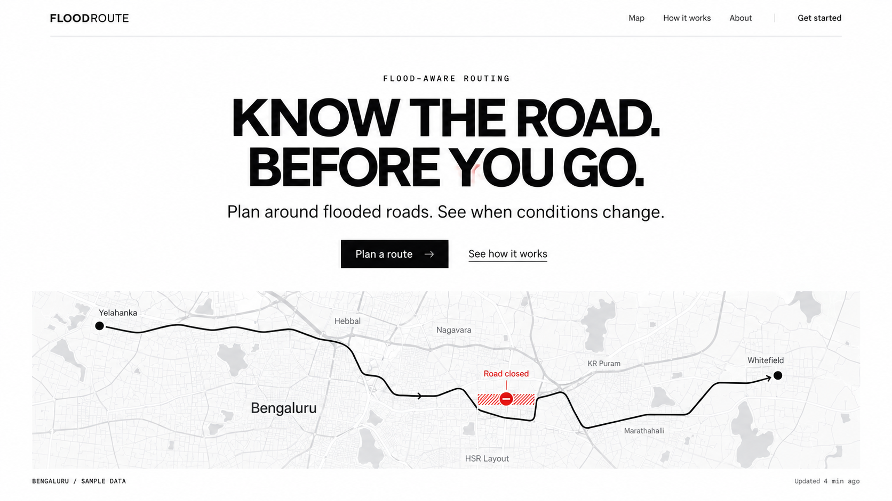
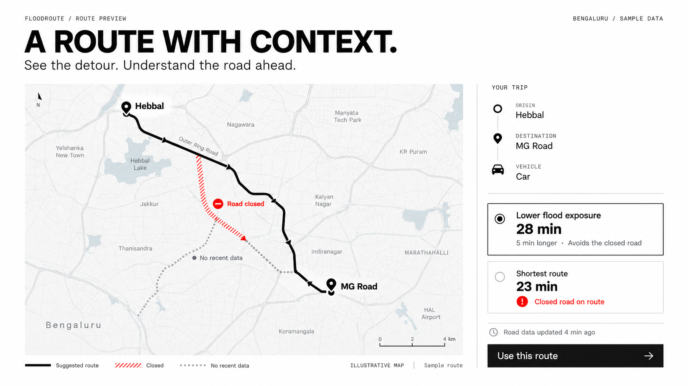
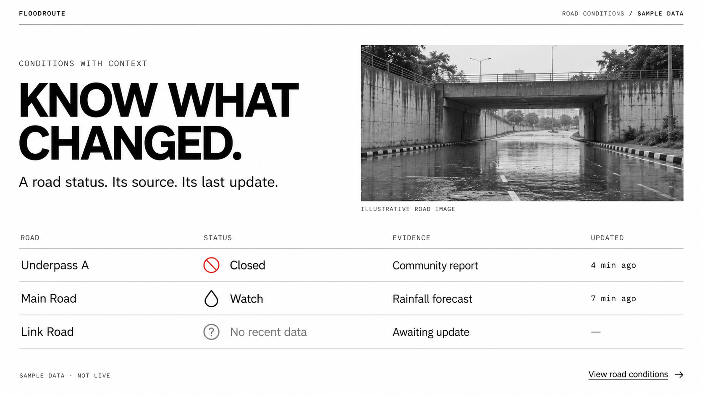

# FloodRoute visual samples

Generated with built-in imagegen on 2026-10-06. Visual exploration only; maps, road imagery and status data are illustrative.

White background, black typography, generous spacing and sharp industrial rules. Red is reserved for hazards.

## 1. Hero



### Generation prompt

```text
Use case: ui-mockup.
Generate one premium high fidelity desktop website HERO SECTION reference image for FloodRoute, an Indian flood-aware routing product. Single horizontal 16:9 canvas, 1536 x 864 visual composition, edge-to-edge actual website screenshot with no device frame, no tilted perspective, no collage and no extra page sections.
User's direction: BLACK AND WHITE, premium standard frontend, Apple-like restraint merged with Swiss industrial print. Choose WHITE BACKGROUND #FFFFFF throughout, near-black #111111 typography, soft neutral grayscale maps, a tiny hazard-red #E61919 used ONLY on a flooded road annotation. No other colors. It should look beautifully calibrated, calm and expensive: enormous breathing room, refined Swiss grotesk type, extremely precise alignments, sharp rectangular components, 1px hairline rules. No gradients, shadows, rounded cards, glass, giant decorative numerals, gritty texture or tactical HUD junk.
Composition: miniature elegant top nav with FLOODROUTE wordmark at left, product navigation at right. Wide generous margins around 80px. Main hero is a centered restrained typography composition in the upper middle: a compact mono eyebrow "FLOOD-AWARE ROUTING"; a concise strong black grotesk two-line title "KNOW THE ROAD.\nBEFORE YOU GO." around 72px with tight tracking and calm medium weight, not ultra-heavy. Under it a readable 20px sentence "Plan around flooded roads. See when conditions change." One sharp black rectangular primary button "Plan a route" with small white arrow; secondary text link "See how it works". Keep controls readable and generous. No Apple logos.
Below, a single wide shallow inline map preview occupies lower 32% of the same hero, with fine gray streets and very sparse map labels for Bengaluru, matte white. A black route line elegantly bends around one red hatched closure labelled "Road closed". Map visibly feels like a real careful cartographic UI, not a dashboard or decorative abstract squiggle. Under this map include one small crisp caption "BENGALURU / SAMPLE DATA" and a subtle small "Updated 4 min ago" label. Data and geography are illustrative. No real-time guarantees, accuracy percentages or testimonials.
One section only; the map is the hero asset. Artwork must show a real buildable web hierarchy and excellent pixel-level typographic quality. Typography and whitespace are primary; industrial structure is subordinate. Use exactly the specified concise text, no invented filler.
```

## 2. Route planner



### Generation prompt

```text
Use case: ui-mockup.
Generate one premium high fidelity desktop website PRODUCT / ROUTE PLANNER SECTION reference for FLOODROUTE. Single horizontal 16:9 image, edge-to-edge frontend screenshot, ONE SECTION only, no device frame, no perspective, no collage, no additional hero or footer.
Consistent design system: WHITE #FFFFFF background, near-black #111111 text and action, light-gray cartography, tiny hazard RED #E61919 for closed roads ONLY. Apple-like premium restraint and generous negative space blended with Swiss industrial grid: clean tightly tracked grotesk headings, restrained monospace metadata, one-pixel rules, exact alignment, sharp 90-degree corners. No gradients, soft shadows, rounded cards, dark substrate, glass, noisy textures, sci-fi HUDs or unrelated colors.
Section heading at top aligned left with huge breathing room: small "FLOODROUTE / ROUTE PREVIEW", title "A ROUTE WITH CONTEXT." in clean medium-bold black grotesk at a restrained 54px, and readable sentence "See the detour. Understand the road ahead." Upper right label "BENGALURU / SAMPLE DATA". Overall frame around 80px margins.
Composition anchor: visual left 65% / supporting summary right 30%. A single very carefully drawn grayscale street map dominates the middle and lower left. Black route with direction arrowheads and distinct origin/destination round pins connects Hebbal and MG Road along streets. A red hatched CLOSED road segment is avoided by a visible black detour. Annotation "Road closed" with prohibition icon, closure distinguished by BOTH red, hatching and text. A secondary unknown small road is dotted gray and labelled "No recent data". Map has wide white air and sparse correct-looking labels, no satellite color, no pointless charts. Under map a concise inline legend with black line "Suggested route", red hatch "Closed", gray dots "No recent data"; data caption "ILLUSTRATIVE MAP".
Right summary column anchored to grid separated by one hairline vertical rule, spacious rather than dense. Use exact text in sane hierarchy: "YOUR TRIP", origin field "Hebbal", destination field "MG Road", vehicle choice "Car". Two ruled route rows with a clear selected first choice: "Lower flood exposure" with larger "28 min" and small supporting line "5 min longer · Avoids the closed road". Second unselected subdued row "Shortest route" with "23 min" and a readable red warning "Closed road on route"; this unselected option has no primary action. Show timestamp "Road data updated 4 min ago". One wide black square-corner button "Use this route" with right arrow at lower right. Small caption "Sample route" clearly visible.
It must look like a precision navigation tool developed by a premium design team, not an emergency dashboard. No guaranteed safety claim, no fabricated accuracy, no fake testimonials. Typography is crisp and readable; body normal case, metadata uppercase, strong spacing. One route preview section, no other page sections.
```

## 3. Road conditions



### Generation prompt

```text
Use case: ui-mockup.
Generate one premium high fidelity desktop website ROAD CONDITIONS / EVIDENCE SECTION reference image for FLOODROUTE. Single HORIZONTAL 16:9 frame, flat edge-to-edge website screenshot, one focused section only. No full landing page, no collage, no device mockup, no perspective.
Match the premium FLOODROUTE black and white style: pure WHITE #FFFFFF substrate, near BLACK #111111 typography and controls, neutral gray rules and photography, tiny hazard RED #E61919 ONLY for a closure label. Apple-like restraint, extremely generous whitespace, Swiss industrial print grid, carefully proportioned grotesk typography, crisp aligned 1px dividing rules, square 90-degree corners. No gradients, rounded cards, soft shadows, glass, colored photographs, faux tactical interfaces, noisy grain, gimmicky oversized numerals, fake testimonials or accuracy claims.
Composition anchor: top-left lead, support bottom-right, off-grid editorial offset with deliberate alignment. Across the top at generous 80px margins: tiny left wordmark "FLOODROUTE", tiny right label "ROAD CONDITIONS / SAMPLE DATA", one hairline rule.
Left upper area: small uppercase mono label "CONDITIONS WITH CONTEXT". A short powerful two-line 64px medium-bold Swiss grotesk heading "KNOW WHAT\nCHANGED." Left below it, readable 20px sentence "A road status. Its source. Its last update." Keep huge white space above and around these elements.
One rectilinear horizontal grayscale documentary photograph lives in the right upper-middle quadrant: a quiet Indian city underpass after rain with standing shallow water and empty road, viewed from the approach; restrained photo looks editorial and real, not dramatic disaster imagery, no people, no vehicles driving through water. Caption below "ILLUSTRATIVE ROAD IMAGE". Its right edge aligns to the page margin.
Beneath the title and photograph, one clean table spans most of the width with three generously spaced hairline-divided rows, no surrounding cards. Four clear column titles "ROAD", "STATUS", "EVIDENCE", "UPDATED". Use exact concise sample copy:
Row one: "Underpass A" / red prohibition icon + "Closed" / "Community report" / "4 min ago".
Row two: "Main Road" / outlined droplet icon + "Watch" in BLACK / "Rainfall forecast" / "7 min ago".
Row three: "Link Road" / outlined question-mark icon + "No recent data" in GRAY / "Awaiting update" / "—".
Use 18px readable row text, 13px restrained monospace column headings and timestamps. No color-only status communication. Unknown explicitly differs from clear. All road names and status data are samples. Table is sparse and calm, not highly dense or a wall of metadata. The photo and table form a clear evidence narrative rather than unrelated decoration.
Bottom right: underlined precise text CTA "View road conditions" and simple right arrow, no pill button. Bottom left tiny caption "SAMPLE DATA · NOT LIVE". Wide breathing room throughout, exceptionally clear hierarchy. White background throughout including photo surround, title and table; no dark background band.
```
